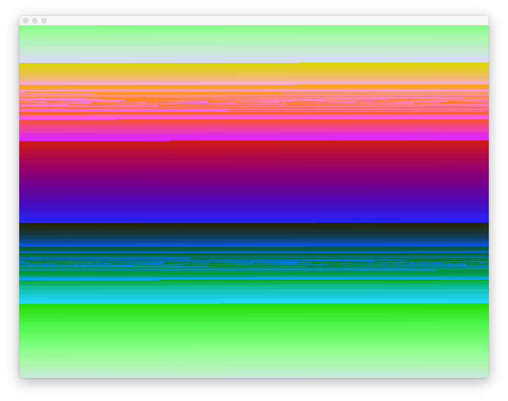

# Image Processing

##Types of Images
* * * 

###Raster Images
* rectangular arrays of picture elements (called pixels)

###Vector Images
* consist of a number of graphical primitives such as lines, circles, and curves

###Ex. 1 - What do types of images are captured with raster images? vector images?


##Loading & Drawing An Image
* * * 


In this tutorial, we will work with raster images only. 

###To upload and draw an image:

1. Declare the image object using openFrameworks object ofImage. 
2. Load the image from a file. Typically, you place your image in the bin/data folder; however, you can store it elsewhere if you declare the file path. 
3. Draw the image by using the draw() method of ofImage and passing (x,y) coordinates for the top-left corner of the image. 

###ofApp.h file 
```
ofImage myImage; 
```

###ofApp.cpp file 
```
void ofApp::setup(){
	myImage.loadImage(fileName); 
}

void ofApp:draw(){
	myImage.draw(x, y); 
}	
```

####Working with ofImage object 
* You can also change the size of your image by passing width and height values:

```
myImage.draw(x, y, w, h); 
```
* ofImage has built in methods and attributes. If you want to scale an image or retreive the original size of an image, you can use:

```
myImage.width;
myImage.height;
```

###Ex. 2 - Upload and draw an image of your choice. Use the width and height fields to manipulate the size of the image.

###Ex. 3 - Use ofTranslate(), push & pop matrices, ofRotate, ofScale() and a for loop to create a collage of images with varying orientation and size. 
Tips: 

* use the translate methods you learned from recursion

##Color Manipulation
* * * 


###Color Modulation
You can maniuplate the color of an image by changing the individual color of each pixel using ofSetColor(). These will result in color modulations that are similar to tonal corrections. 

* Setting r, g, b values equal to 255 will keep the image colors as normal
* Changing a specific channel to 255 and the remaining channels to 0 will drawing that specific color channel. For example, to only draw the blue channel:

```
ofSetColor(0 ,0, 255);
myImage.draw(ofGetWidth()/2, ofGetHeight()/2); 
```
###Transparency
* Alpha controls the pixel's opacity with minimum alpha value equal to 0 where the pixel is completely transparent.
* The max alpha value is equal to 255 and the pixel is opque.
* Blending is the process of overlapping colors with transparency.

####Blending Modes in OF
* By default, openframeworks is set to alpha blending. However, there are 4 additional types of blending.

1. Alpha Mode (which is the default mode): ```OF_BLENDMODE_ALPHA```

2. Add Mode: ```OF_BLENDMODE_ADD```

3. Multiply Mode: ```OF_BLENDMODE_MULTIPLY```

4. Subtract Mode: ```OF_BLENDMODE_SUBTRACT```

5. Screen Mode: ```OF_BLENDMODE_SCREEN```

* To switch the blending mode, call:

```
ofEnableBlendMode( BLEND MODE HERE); 
```
* To change the alpha variable, pass in a 4th variable to ofSetColor() on the 0-255 range

```
ofSetColor(r, g, b, a); 
```

###Ex. 4 - Explore using of blending modes and take a look at examples/graphics/blending. Based on your findings, how is each blend mode different? 

##Generating & Manipulating Images
* * * 


To manipulate an existing image, the pixel data is minipulated directly. Raster images are an array of pixels. To find the number of pixels in an array, you multiply the width of the image by the height. Each horizontal row of pixel data is stored sequentially -- row 1, row 2, row 3, etc. 

###Image Generation

###ofApp.h

Declare an image object, image height, and image width

```
ofImage myImage; 
int h, w;

```

###ofApp.cpp
Set w and h to the width and height of the screen

```
void ofApp::setup(){
	w = ofGetWidth();
	h = ofGetHeight(); 
}

```

Create an array to store the pixel data as unsigned char values. The size of the array is the ```height*width*numberColorValues``` where numberColorValues is how many data values are used for the color value. We will use alpha, therefore the numberColorValues is equal to 4.

```
void ofApp::update(){
	unsigned char *data = new unsigned char[w * h * 4];
	//the "*" is a pointer; we will worry about this later

}

```
Create variables for the r, g, b, a values and set them equal to appropriate values. Pass them to the data array. Note, index is a counter that counts by 4 which is used so that we can set each value of the pixel with 4 values. 

```
void ofApp::update(){
	 for (int y=0; y<h; y++) {
        for (int x=0; x<w;  x++) {
            
            int red = ofMap( sin(ofGetElapsedTimef()), -1, 1, 0, 255 );
            int green = ofMap( cos(ofGetElapsedTimef()), -1, 1, 0, 255 );
            int blue = ofMap( tan(ofGetElapsedTimef()), -1, 1, 0, 255 );
            int alpha = 255;  
            
            int index = 4 * ( x + w * y );
            cout << "indexs: " << index << endl;
            data[ index ] = red;
            data[ index + 1 ] = green;
            data[ index + 2 ] = blue;
            data[ index + 3 ] = alpha;
      
        }
    }
}

```
Lastly, in the update function but outside of the previous for loop, load the array to your image and delete your data array. 


```
void ofApp::update(){
	 myImage.setFromPixels(data, w, h, OF_IMAGE_COLOR_ALPHA);
    delete[] data;

}

```
Finally draw your image. 

```
void ofApp::draw(){
	 ofBackground(255, 255, 255);
    ofSetColor( 255, 255, 255 );
    myImage.draw( 0, 0 );

}

```
Your sketch should look like this: 



###Ex. 5 Create your own image where r, g, b, and a are equal to functions that vary according to ofNoise() and ofGetElapseTimef()

##Manipulating Images
* * * 


To manipulate an existing image, you need to store the pixels of the image in an array using ```myImage.getPixels()```. After manipulating the array, use ```myImage.update()``` to change and update the image. 

###Ex. 6 Using the same structure used for generating an image, manipulate an existing image. 
Tips: 

* you will need to store the pixel images in an array again using ```unsigned char *data = myImage.getPixels()``` 
* and then create a variable to calculate the number of pixels using the bpp attribute (which is the bits per pixel) divided by 8. Bites per pixel / 8 = bytes per pixel

##Homework
* * * 

* Create an app using imgae processing and a topic not discussed in class. Create a tutorial for your app in markdown and submit to your github. You will present your tutorial next week in class.
*  Moodboard and brainstorm your final project. Come in with a concept and workplan for your final project. Workplan should include what technologies you need to use, concepts you need to research, and a schedule for implementation. Next week's class will be a workshop class, and I'll meet with each of you individually. 

##Markdown
* * * 


* Markdown is a text to HTML conversion tool for web writers.
* [Mastering Markdown tutorial] (https://guides.github.com/features/mastering-markdown/) 
* [Markdown cheat sheet](https://github.com/adam-p/markdown-here/wiki/Markdown-Cheatsheet#images)